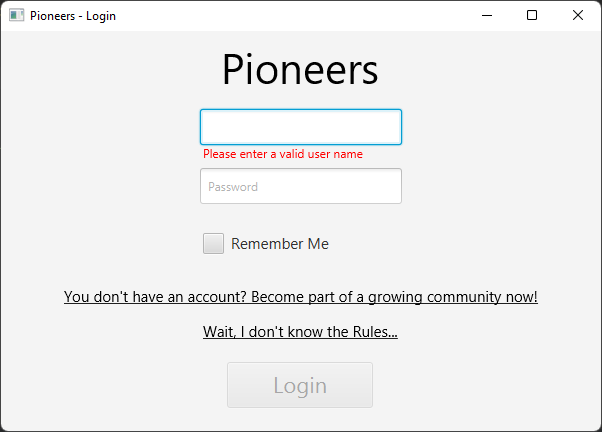

# stp-22-team-h

<div id="top"></div>

<br>
<h3 align="center">Pioneers</h3>
<div align="center">
  <p align="center">
    Contract work for Dead Birds Society
  </p>
</div>
<br>

<!-- TABLE OF CONTENTS -->
<details>
  <summary>Table of Contents</summary>
  <ol>
    <li>
      <a href="#about-the-project">About The Project</a>
      <ul>
        <li><a href="#built-with">Built With</a></li>
      </ul>
    </li>
    <li>
      <a href="#getting-started">Getting Started</a>
      <ul>
        <li><a href="#prerequisites">Prerequisites</a></li>
        <li><a href="#installation">Installation</a></li>
      </ul>
    </li>
    <li><a href="#usage">Usage</a></li>
    <li><a href="#roadmap">Roadmap</a></li>
    <li><a href="#contributing">Contributing</a></li>
    <li><a href="#license">License</a></li>
    <li><a href="#contact">Contact</a></li>
    <li><a href="#acknowledgments">Acknowledgments</a></li>
  </ol>
</details>


<!-- ABOUT THE PROJECT -->
## About The Project
<br>

<div align="center">
  <a href="https://github.com/sekassel/stp-22-team-h">
    
  </a>
</div>

<br><br>
Pioneers is a contract work for Deadly Birds Society to develop a modern clone of Settlers of Catan. Among other things, it features a comprehensive chat function and the possibility to play online with other settlers.

<p align="right">(<a href="#top">back to top</a>)</p>

### Built With

* [Java 17](https://www.oracle.com/java/)
* [JavaFX 18](https://openjfx.io/)
* [Retrofit](https://square.github.io/retrofit/)
* [Dagger](https://dagger.dev/)
* [RxJava](https://reactivex.io/)
* [javax.websocket](https://frontbackend.com/maven/artifact/javax.websocket)

<p align="right">(<a href="#top">back to top</a>)</p>


<!-- GETTING STARTED -->
## Getting Started

To play Pioneers you only need Java 17 or higher and an active connection to the Internet.

### Prerequisites

* Java 17
  ```sh
  https://www.oracle.com/java/technologies/downloads/#java17
  ```

### Installation

1. Download and install Java 17 or higher
2. Download the executable JAR from Pioneers
3. Launch Pioneers.jar and have fun

<p align="right">(<a href="#top">back to top</a>)</p>


<!-- USAGE EXAMPLES -->
## Usage

Use this space to show useful examples of how a project can be used. Additional screenshots, code examples and demos work well in this space. You may also link to more resources.

_For more examples, please refer to the [Documentation](https://example.com)_

<p align="right">(<a href="#top">back to top</a>)</p>


<!-- ROADMAP -->
## Roadmap

- [ ] Feature 1
- [ ] Feature 2
- [ ] Feature 3
    - [ ] Nested Feature

See the [open issues](https://github.com/github_username/repo_name/issues) for a full list of proposed features (and known issues).

<p align="right">(<a href="#top">back to top</a>)</p>


<!-- CONTRIBUTING -->
## Contributing

Contributions are what make the open source community such an amazing place to learn, inspire, and create. Any contributions you make are **greatly appreciated**.

If you have a suggestion that would make this better, please fork the repo and create a pull request. You can also simply open an issue with the tag "enhancement".
Don't forget to give the project a star! Thanks again!

1. Fork the Project
2. Create your Feature Branch (`git checkout -b feature/AmazingFeature`)
3. Commit your Changes (`git commit -m 'Add some AmazingFeature'`)
4. Push to the Branch (`git push origin feature/AmazingFeature`)
5. Open a Pull Request

<p align="right">(<a href="#top">back to top</a>)</p>


<!-- LICENSE -->
## License

Distributed under the MIT License. See `LICENSE.txt` for more information.

<p align="right">(<a href="#top">back to top</a>)</p>


<!-- CONTACT -->
## Contact

Your Name - [@twitter_handle](https://twitter.com/twitter_handle) - email@email_client.com

Project Link: [https://github.com/github_username/repo_name](https://github.com/github_username/repo_name)

<p align="right">(<a href="#top">back to top</a>)</p>


<!-- ACKNOWLEDGMENTS -->
## Acknowledgments

* []()
* []()
* []()

<p align="right">(<a href="#top">back to top</a>)</p>


<!-- MARKDOWN LINKS & IMAGES -->
<!-- https://www.markdownguide.org/basic-syntax/#reference-style-links -->
[contributors-shield]: https://img.shields.io/github/contributors/sekassel/stp-22-team-h.svg?style=for-the-badge
[contributors-url]: https://github.com/sekassel/stp-22-team-h/graphs/contributors
[product-screenshot]: images/pioneers.png
